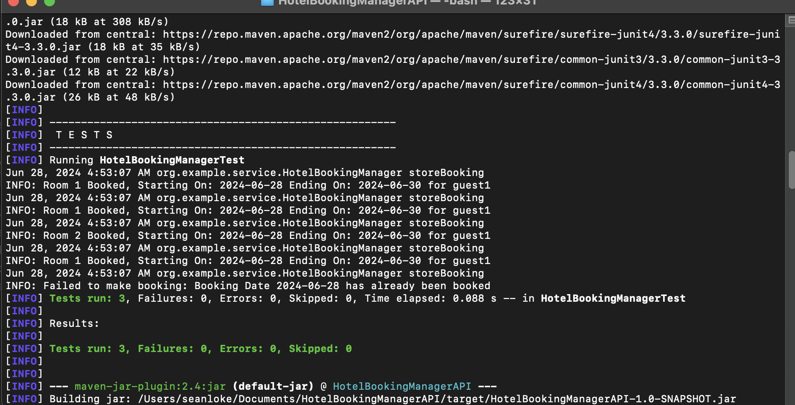
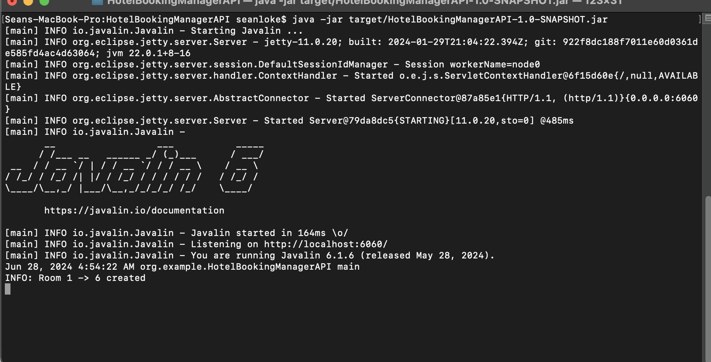
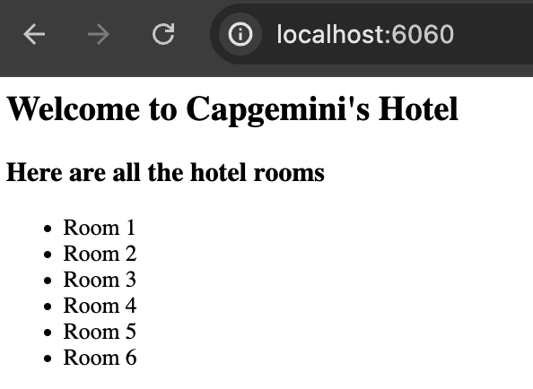
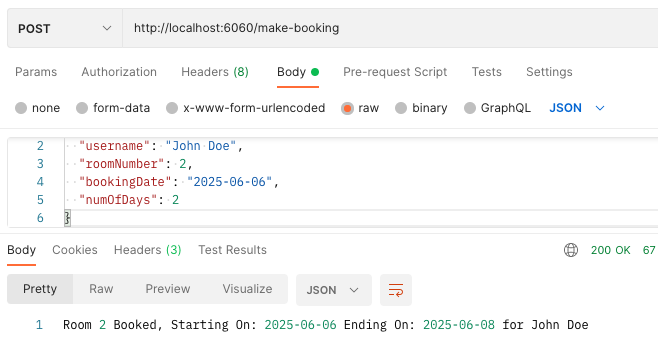
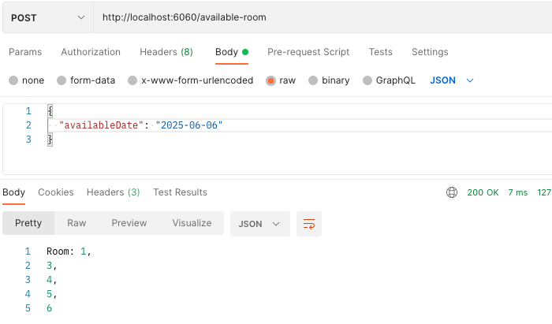
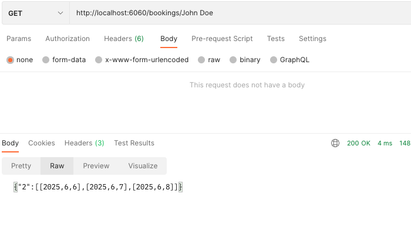
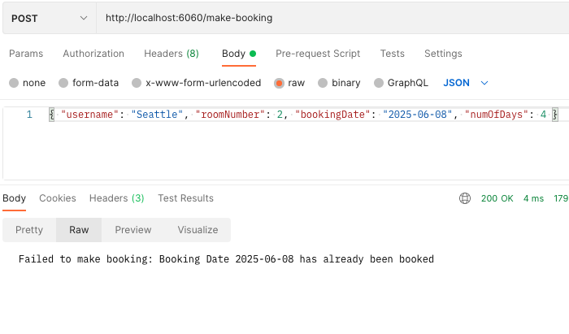

# Hotel Booking API
## Prerequisites
- Java Development Kit (JDK) installed on your machine
- Maven or Gradle for building the project
- Git for cloning the repository

## Installation
1. Clone the repository to your local machine
2. Navigate to the project directory
3. Build the project using Maven:
```
mvn clean package
```
4. Run the jar file to start the HTTP server:
```
java -jar target/HotelBookingManagerAPI-1.0-SNAPSHOT.jar
```
5. Use Postman to make HTTP requests to the API endpoints:
- Store Booking:
  `POST /make-booking`
- Find Available Rooms using date:
  `POST /available-room`
- Find Bookings for Guest:
  `GET /bookings/{username}`

## Example JSON Requests
- Store Booking:
  {
  "username": "John Doe",
  "roomNumber": 2,
  "bookingDate": "2025-06-06",
  "numOfDays": 2
  }
- Find Available Rooms using date:
  {
  "availableDate": "2025-06-06"
  }
- Find Bookings for Guest:
http://localhost:6060/bookings/John Doe







